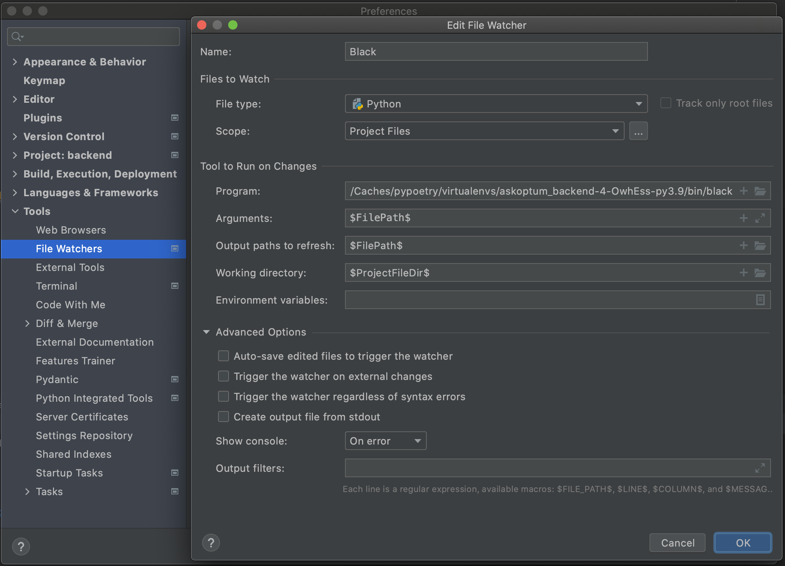

# AskOptum Backend

- [API Documentation](#api-documentation)
- [Development](#development)
  - [Docker](#docker)
  - [Native](#native)
- [Authentication](#authentication)
- [Configuration](#configuration)
- [Monitoring and Observability](#monitoring-and-observability)
  - [Logging](#logging)
  - [Metrics](#metrics)
  - [Tracing](#tracing)
- [Dependency Management](#dependency-management)
- [Code Style](#code-style)
- [Using the API](#using-the-api)
- [Testing](#testing)

The backend is based on the [FastAPI](https://fastapi.tiangolo.com/) which should be familiar to folks who have used Flask 
in the past.

It is responsible for:

* Performing upstream API calls on behalf of user interactions (such as searching)
* *Future* Managing content crawlers, and their associated indexing functions

## API Documentation

Can be found via path `/api/docs`

See [https://dev.ask.optum.ai/api/docs](https://dev.ask.optum.ai/api/docs).

## Development

There are two main ways to set up and run this project on your local system. The choice is influenced by how much actual backend dev you will be doing and if you wish to easily use a debugger. The modes are [docker](#docker) and [native](#native).

### Docker

Use this method if you just need to get the API up and running to test things.

Set up config and build/run the container:
```bash
# From the /backend directory
APP_CONFIG_CONNECTION_STRING=$(az appconfig credential list -g rg-askoptum-dev --subscription 8a8f04fc-cf3d-433f-972a-5ff0e8615f54 -n conf-askoptum-dev --query '[3].connectionString' -o tsv)
docker build -t aoapi . && docker run -p 8000:80 --env APP_CONFIG_CONNECTION_STRING=$APP_CONFIG_CONNECTION_STRING aoapi
```

* Access swagger/openAPI via `http://localhost:8000/api/docs`

### Native

Use this method if you wish to run the project inside your IDE to use the debugger or if you just don't care for Docker.

**NOTE:** By default, the server runs on port 8000 in this mode. you can change it in `server.py`.


**Pycharm**
In file `app/api/server.py` at around `if __name__ == "__main__":`
* Click the green 'run' arrow
* This creates a runtime config, edit it (upper right-hand corner, named "server")
* Make your working directory look like: `<your full path to AskOptum/backend/>`
* Check both PYTHONPATH boxes
* Add the `APP_CONFIG_CONNECTION_STRING` environment variable
* Install the [File Watchers](https://plugins.jetbrains.com/plugin/7177-file-watchers) plugin, and configure `black` to format code on save. 




**Local**
* From the /backend folder
  * Set the source roots: `export PYTHONPATH="$PWD"`
  * Launch server: `python app/api/server.py`
    
* The backend container listens on port 80 by default
    
* It is possible to run the server out of the docker context:
    * Switch to working dir `cd backend`
    * Set the source roots: `export PYTHONPATH="$PWD"`
    * Launch server: `python app/api/server.py`
    * *Note:* the server will run on port 8001 in this mode
    * *Note:* you will need to run the database on your own
    
* It is also possible to run the backend in pycharm:
    * Just make sure you have 'add source roots to pythonpath' is checked
    * It's possible to attach a debugger in this mode
    

## Authentication

We use the [Microsoft Authentication Library (MSAL)](https://docs.microsoft.com/en-us/azure/active-directory/develop/msal-overview) for authentication with Azure AD B2C. 
Azure AD B2C brokers logins with (currently) two IDPs:
- UHG Azure AD
- Healthsafe ID

Redirect URIs for our UIs are configured in AD B2C in each app registration's authentication blade.

## Configuration

We use [Azure App Configuration](https://azure.microsoft.com/en-us/services/app-configuration/) to store all config remotely. Config is fetched on server startup, and stored in-memory. The `APP_CONFIG_CONNECTION_STRING` environment variable is set to a read key + URL of our app config service. 

Configuration is periodically (every 5m) polled for updates. Logic has been written such that configuration is only refreshed if the value of `CONFIG_VERSION` has been increased. Doing this allows you to make multiple config changes at your own pace, and then "apply" them to the server by incrementing the version. `CONFIG_VERSION` is cached in-memory, and referenced throughout the server's runtime. If the value has increased since the last value that was observed, configuration changes are applied. 

To add some form of type-safety to remote values, config keys are represented in the `RemoteConfig` enum in `app/core/config.py`.


## Monitoring and Observability

We use [OpenCensus](https://github.com/census-instrumentation/opencensus-python) and the [OpenCensus Azure Monitor integration](https://github.com/census-instrumentation/opencensus-python/tree/master/contrib/opencensus-ext-azure) to log and export data to app insights and log analytics workspaces.

[Telemetry type mappings](https://docs.microsoft.com/en-us/azure/azure-monitor/app/opencensus-python#telemetry-type-mappings)

| Pillar of observability | Telemetry type in Azure Monitor    | Explanation                                         |
| ----------------------- | ---------------------------------- | --------------------------------------------------- |
| Logs                    | Traces, exceptions, customEvents   | Log telemetry, exception telemetry, event telemetry |
| Metrics                 | customMetrics, performanceCounters | Custom metrics performance counters                 |
| Tracing                 | Requests dependencies              | Incoming requests, outgoing requests                |

### Logging

An instance of an [`opencensus.ext.azure.log_exporter.AzureLogHandler`](https://github.com/census-instrumentation/opencensus-python/blob/master/contrib/opencensus-ext-azure/opencensus/ext/azure/log_exporter/__init__.py) is used to ship all logs to app insights. We use the popular [Loguru](https://loguru.readthedocs.io/en/stable/) package for all logging operations, and a proxy handler has been created to connect Loguru with app insights. 
### Metrics

Currently, most metrics we need are derived from logs. An instance of a [`opencensus.ext.azure.metrics_exporter`](https://github.com/census-instrumentation/opencensus-python/blob/master/contrib/opencensus-ext-azure/opencensus/ext/azure/metrics_exporter/__init__.py) has been created and will be used in the future to aggregate metrics around the api.

### Tracing

We use the [`opencensus.ext.azure.trace_exporter`](https://github.com/census-instrumentation/opencensus-python/blob/master/contrib/opencensus-ext-azure/opencensus/ext/azure/trace_exporter/__init__.py) to export metadata related to traces to app insights. 


## Dependency Management

[Poetry](https://python-poetry.org/) is used for dependency management, as opposed to `pip`. 

[Installation docs](https://github.com/python-poetry/poetry#installation)

To install all dependencies (from the `./backend` dir):

```bash
poetry install
```

To grab a shell in the virtual env: 

```bash
poetry shell
```
## Code Style

[Black](https://black.readthedocs.io/en/stable/) is used as a formatter for the backend codebase. To format the entire codebase, grab a `poetry shell` and run:

```bash
black ./app
```


## Using the API

In order to send requests you can use the swagger/OpenAPI or use `curl` as shown below:

```
curl -X 'GET' \
  'http://localhost:8000/api/search/?q=I%20have%20back%20pain' \
  -H 'accept: application/json'
```

## Testing

[pytest](https://docs.pytest.org/en/stable/) is used, and I prefer to run it from the server container, but it can be run natively if you prefer.

* `docker exec -it <YOUR_CONTAINER_ID> bash`
* `pytest`
